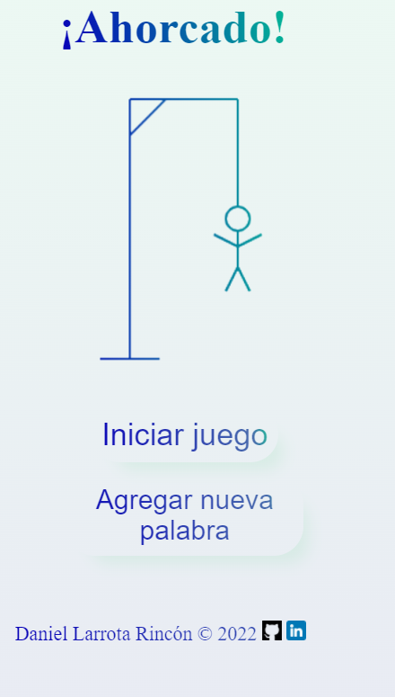
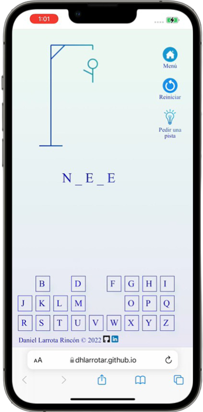

# Hangman- ¡Juego del ahorcado!

## Idiomas disponibles / Available languages 🗣️
- Español
- English

## Descripción / Description 📉

### Español
¡Adivina la palabra secreta antes de quedar colgado! Durante el juego puedes pedir una pista, volver a intentar e incluso agregar tu propia palabra al juego!

### English
Guess the secret word before you get hung up! You can ask for a hint, start over, and even add your own word to the game!

 

  

## Construido con / built with 🛠️

  

## Probar ahora! / Test now! 🚀

 

## Temas / Topics
Este proyecto fue realizado durante el programa Oracle Next Education (ONE) como segundo desafío de lógica de programación.
