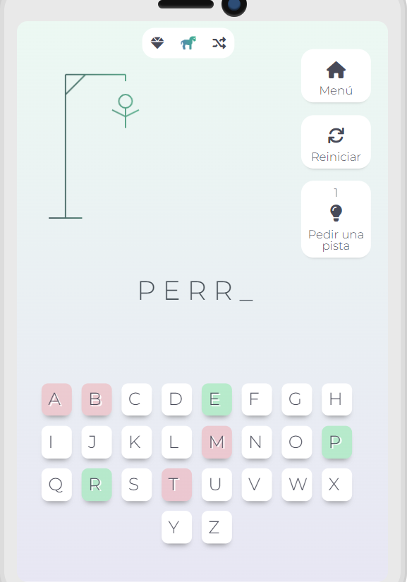
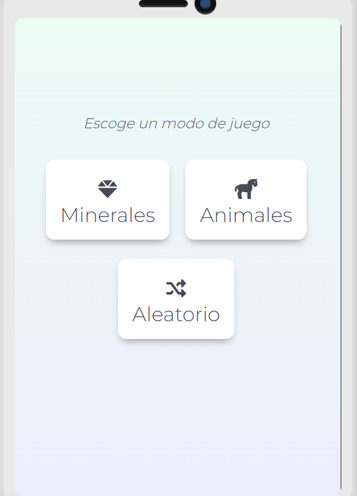

# Hangman- ¡Juego del ahorcado!

## Descripción 📉
¡Adivina la palabra secreta antes de quedar colgado! Durante el juego puedes pedir una pista, volver a intentar e incluso agregar tu propia palabra al juego!

  

## Construido con 🛠️

  

## Probar ahora 🚀

 

## Temas 🎨

Este proyecto fue realizado durante el programa Oracle Next Education (ONE) como segundo desafío de lógica de programación.
